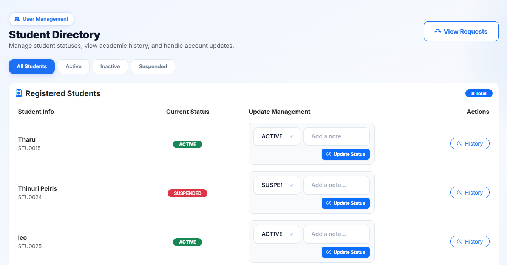
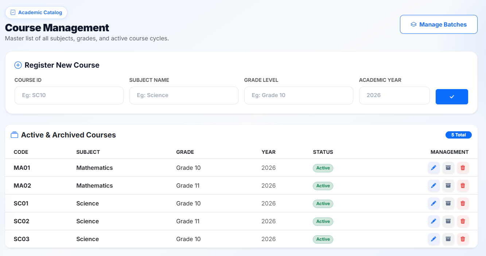
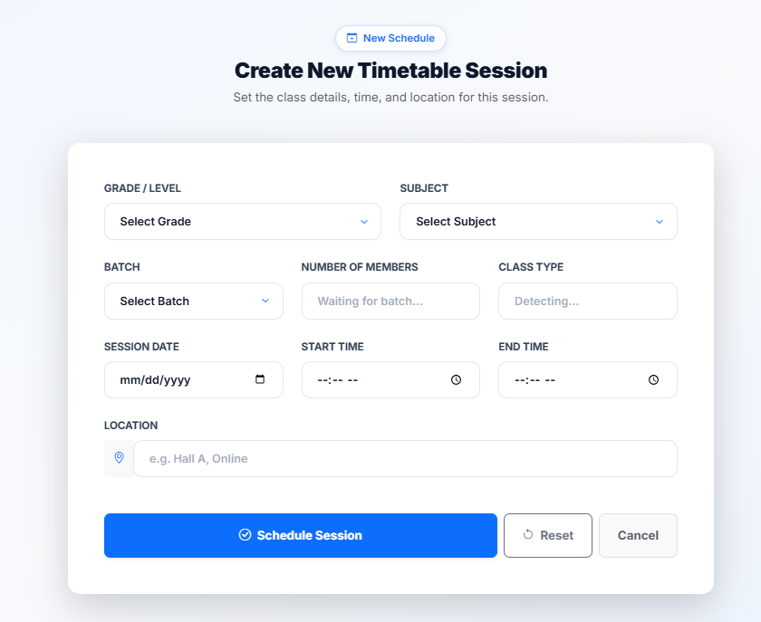
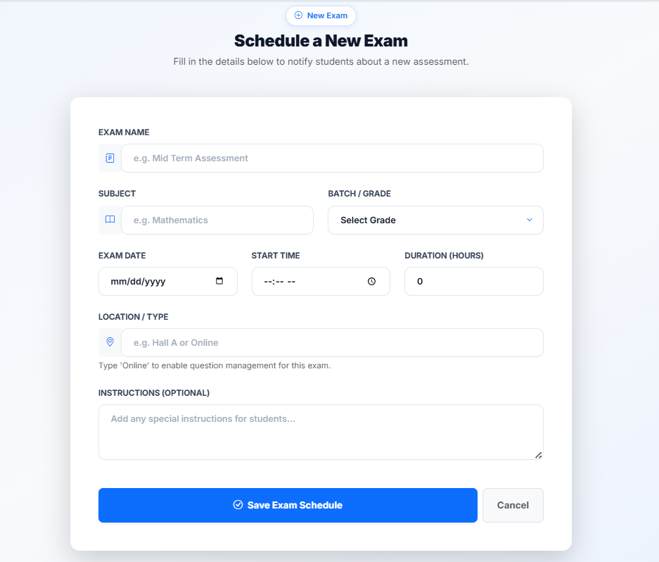
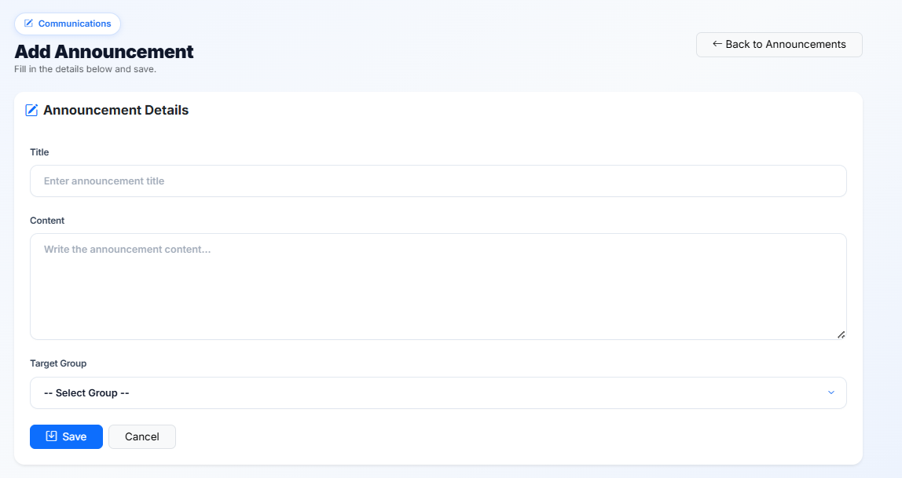
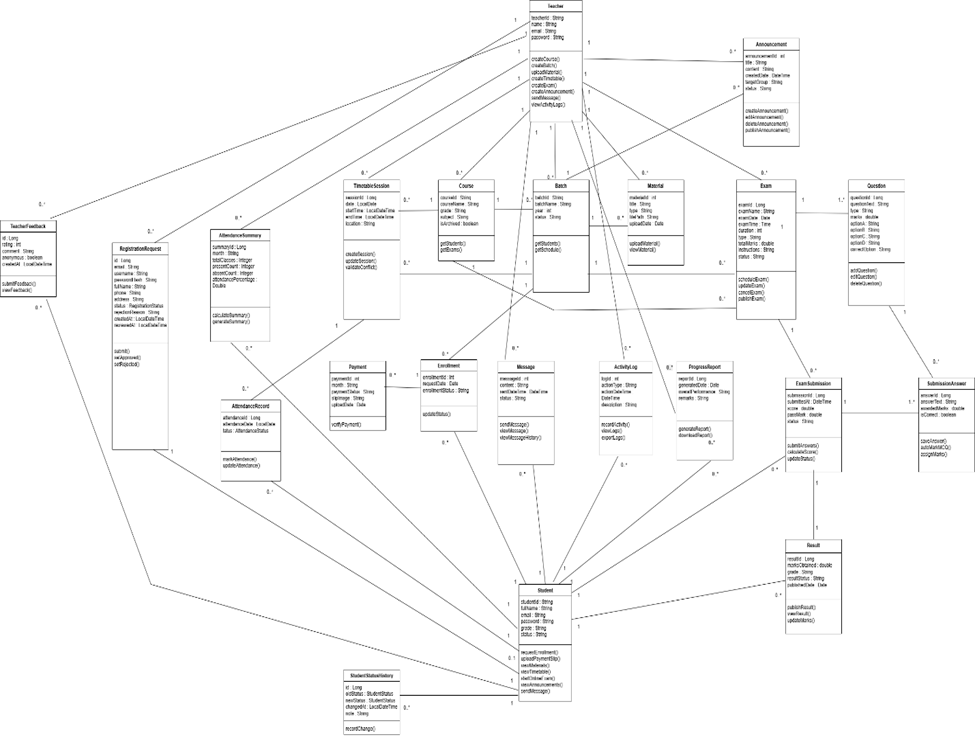
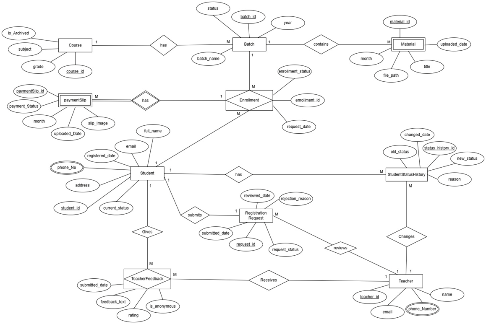
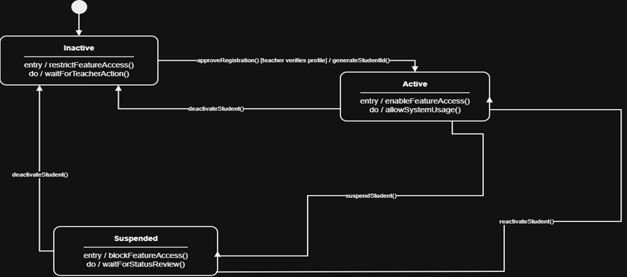

# Tuition Class Management System

A web-based Tuition Class Management System developed as a Year 2 Semester 2 Information Systems Project at Sri Lanka Institute of Information Technology (SLIIT).

The system is designed to help a single tuition class teacher manage academic and administrative activities such as student registration, course enrollment, class scheduling, attendance tracking, examinations, academic performance, announcements, messaging, and activity logs.

## Project Information

- **Project Title:** Tuition Class Management System
- **Project ID:** ISP_G21
- **Module:** Information Systems Project 2026
- **Institution:** Sri Lanka Institute of Information Technology (SLIIT)
- **Project Type:** Academic Group Project
- **Status:** Completed

## Problem Overview

In a traditional tuition class environment, many academic and administrative tasks are handled manually. These tasks include student registration, course enrollment, timetable management, attendance tracking, examination handling, payment verification, and communication between the teacher and students.

Manual handling can increase the teacher’s workload, make records difficult to manage, cause data errors, and lead to miscommunication. The Tuition Class Management System solves these issues by providing a centralized digital platform to manage tuition class activities in a more organized, accurate, and efficient way.

## Main Modules

The system consists of five main modules:

1. **Student Management**
2. **Course and Enrollment Management**
3. **Class and Attendance Management**
4. **Examination and Academic Performance Management**
5. **Academic Communication and Activity Management**

## Key Features

### Student Management

- Student registration through an online form
- Mandatory field validation
- Teacher approval or rejection of student registration requests
- Automatic student ID generation for approved students
- Student registration status viewing
- Student status management: Active, Inactive, Suspended
- Student feedback submission

### Course and Enrollment Management

- Course creation based on grade, subject, and batch
- Batch creation and management
- Student enrollment request submission
- Teacher approval or rejection of enrollment requests
- Assignment of approved students to relevant batches
- Monthly subject material uploads
- Student payment slip uploads
- Teacher payment slip verification
- Approval or rejection of payment slips
- Restriction of material access for unpaid students
- Material downloads after payment approval

### Class and Attendance Management

- Class timetable creation
- Scheduling conflict prevention
- Teacher class schedule viewing
- Student timetable viewing
- Attendance marking for class sessions
- Attendance record updating
- Student attendance record viewing
- Monthly attendance summary generation

### Examination and Academic Performance Management

- Examination scheduling
- Examination editing and deletion
- Online examination support
- Student answer submission
- Secure storage of submitted answers
- Student marks entry and updating
- Examination result publishing
- Student result viewing
- Student progress report generation

### Academic Communication and Activity Management

- Announcement creation
- Announcement editing and deletion
- Student announcement viewing
- Teacher-to-student messaging
- Student-to-teacher messaging
- Message history viewing
- User activity logging
- Teacher activity log viewing

## Technologies Used

### Backend

- Java
- Spring Boot
- Spring MVC
- Spring Data JPA
- Hibernate ORM
- Maven

### Frontend

- HTML
- CSS
- JavaScript
- Thymeleaf

### Database

- SQL Server Management Studio

### Tools

- IntelliJ IDEA
- Antigravity
- SQL Server Management Studio
- Git
- GitHub
- Postman

## System Architecture

The system follows a modular and layered architecture. Each major project epic is implemented as a separate module and integrated into one complete web application.

The main layers are:

- **Presentation Layer** - Handles the user interface using HTML, CSS, JavaScript, and Thymeleaf.
- **Business Logic Layer** - Handles application logic using Spring Boot services.
- **Data Access Layer** - Handles database operations using Spring Data JPA repositories.

The project includes controllers, DTOs, entities, repositories, services, templates, and static resources to improve maintainability and code organization.

## Project Structure

```text
tuition-class-management-system/
+-- src/
¦   +-- main/
¦   ¦   +-- java/
¦   ¦   ¦   +-- com/tuition/new_tuition/
¦   ¦   ¦       +-- controller/
¦   ¦   ¦       +-- dto/
¦   ¦   ¦       +-- entity/
¦   ¦   ¦       +-- repository/
¦   ¦   ¦       +-- service/
¦   ¦   ¦       +-- NewTuitionApplication.java
¦   ¦   +-- resources/
¦   ¦       +-- static/
¦   ¦       +-- templates/
¦   ¦       +-- application.properties
+-- pom.xml
+-- mvnw
+-- mvnw.cmd
+-- README.md
```

## Team Members

| Student ID | Name | Project Role | Main Responsibility | GitHub |
|---|---|---|---|---|
| IT24101073 | Praghnarathna M.A. | Scrum Master | Course and Enrollment Management | [@miuniakarsha](https://github.com/miuniakarsha) |
| IT24100906 | Pinnedoowe R.D. | Team Member | Student Management | [@radild](https://github.com/radild) |
| IT24101204 | Peiris H.D.T. | Team Member | Examination and Academic Performance Management | [@DinethmiPeiris](https://github.com/DinethmiPeiris) |
| IT24101104 | Attanayake H.M. | Team Member | Class and Attendance Management | [@hHansaniMalshi](https://github.com/hHansaniMalshi) |
| IT24101767 | Hewage D.N.K. | Team Member | Academic Communication and Activity Management | [@IT24101767](https://github.com/IT24101767) |

## How to Run the Project

### Prerequisites

Make sure the following are installed:

- Java 17 or above
- Maven
- Microsoft SQL Server
- SQL Server Management Studio
- Git

### 1. Clone the Repository

```bash
git clone https://github.com/DinethmiPeiris/tuition_class_management_system.git
```

```bash
cd new_tuition
```

### 2. Configure the Database

This project uses **Microsoft SQL Server** as the database.

Create a new database in Microsoft SQL Server:

```sql
CREATE DATABASE TuitionClassManagementSystem;
```

Then open the following file:

```text
src/main/resources/application.properties
```

Update the database configuration according to your local SQL Server username and password:

```properties
spring.datasource.url=jdbc:sqlserver://localhost:1433;databaseName=TuitionClassManagementSystem;encrypt=true;trustServerCertificate=true
spring.datasource.username=your_username
spring.datasource.password=your_password

spring.jpa.hibernate.ddl-auto=update
spring.jpa.show-sql=true
```

The required database tables are generated automatically by **Spring Data JPA / Hibernate** when the application runs.

### 3. Run the Application

For Windows:

```bash
mvnw.cmd spring-boot:run
```

For macOS/Linux:

```bash
./mvnw spring-boot:run
```

Then open the application in your browser:

```text
http://localhost:8080
```

## Testing

The system was tested to verify both functional and non-functional requirements.

Testing methods used:

- Unit Testing
- Integration Testing
- Manual UI Testing
- Boundary and Negative Testing
- Regression Testing

Testing covered all five modules of the system, including student registration, course enrollment, attendance management, examinations, announcements, messaging, and activity logs.

## Screenshots


The following screenshots show the main interfaces of the Tuition Class Management System.


### Student Registration Status Interface





### Course Management Interface





### Timetable Session Creation Interface





### Exam Scheduling Interface





### Announcement Creation Interface




## Design Diagrams


The main project-level design diagrams are shown below to represent the structure and behavior of the Tuition Class Management System.


### Class Diagram





### ER Diagram





### State Diagram



## Future Improvements

Possible future improvements include:

- Mobile application support
- Improved responsive user interface
- Automated email or SMS notifications
- Online payment gateway integration
- Advanced reporting and analytics
- Real-time chat feature
- Better backup and recovery support

## Academic Note

This project was developed for academic purposes as part of the Year 2 Semester 2 Information Systems Project module at Sri Lanka Institute of Information Technology.

## License

This project is for educational purposes only.
